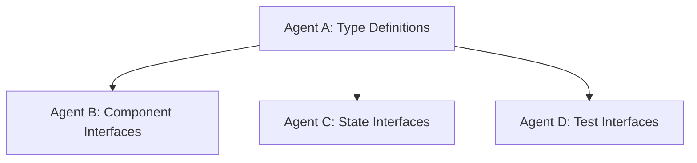
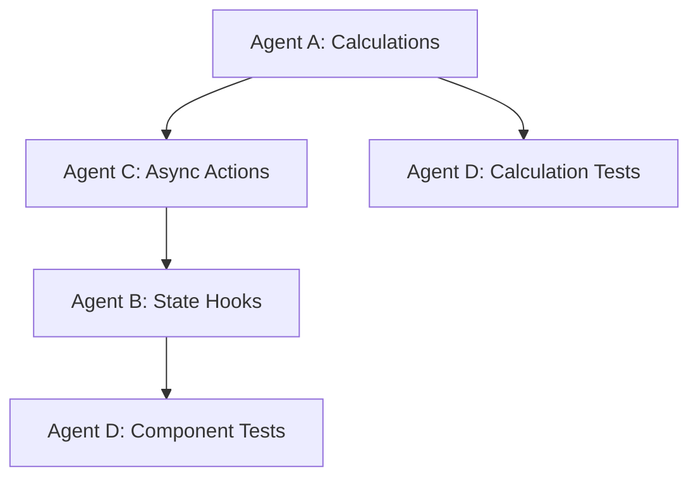
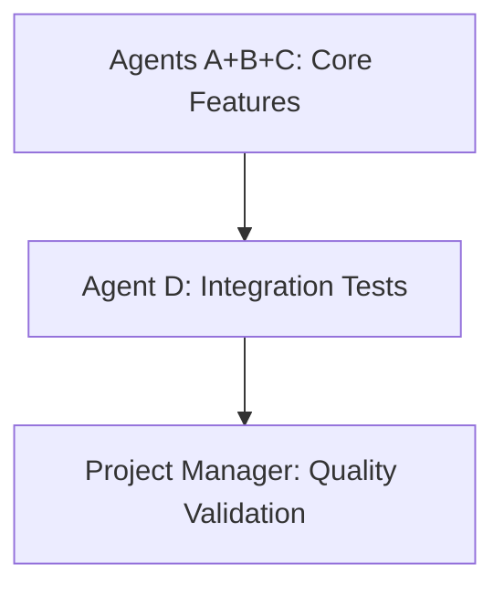

# Wealth Goals System - Integration Status Dashboard

**Session ID:** WG-S04-20250904  
**Last Updated:** 2025-09-04  
**Project Manager:** BufoIndex AI Project Manager

## OVERALL PROJECT STATUS

**Phase:** Foundation Setup  
**Overall Progress:** 5% (Coordination phase)  
**Expected Completion:** 8 weeks from start  
**Risk Level:** LOW - Clear specifications and coordination established

### Agent Status Overview
| Agent | Role | Progress | Status | Blockers | Next Milestone |
|-------|------|----------|--------|----------|----------------|
| **A** | Calculations | 0% | ⏳ Ready | None | Type definitions |
| **B** | UI Components | 0% | ⏳ Ready | Agent A types | Component scaffolding |
| **C** | State Management | 0% | ⏳ Ready | Agent A types | Store integration |
| **D** | Testing & QA | 0% | ⏳ Ready | Agent implementations | Test framework |

## INTEGRATION CHECKPOINT STATUS

### 25% Checkpoint (Week 2) - Foundation
**Target Date:** Week 2  
**Status:** 🔄 SCHEDULED

**Requirements:**
- [ ] Agent A: Type definitions complete and stable
- [ ] Agent B: Component scaffolding with mock data
- [ ] Agent C: State management structure established
- [ ] Agent D: Testing infrastructure ready

**Dependencies Resolved:** None yet

### 50% Checkpoint (Week 4) - Core Development
**Target Date:** Week 4  
**Status:** 🔄 PLANNED

**Requirements:**
- [ ] Agent A: Core calculations implemented and tested
- [ ] Agent B: Interactive UI components functional
- [ ] Agent C: State hooks operational with real data
- [ ] Agent D: Comprehensive test suites created

### 75% Checkpoint (Week 6) - Advanced Features
**Target Date:** Week 6  
**Status:** 🔄 PLANNED

**Requirements:**
- [ ] Agent A: Monte Carlo with Web Worker support
- [ ] Agent B: Chart visualizations complete
- [ ] Agent C: URL persistence and local storage
- [ ] Agent D: Performance benchmarking complete

### 100% Checkpoint (Week 8) - Final Validation
**Target Date:** Week 8  
**Status:** 🔄 PLANNED

**Requirements:**
- [ ] All agents: Cross-integration completed
- [ ] All agents: Quality gates passed
- [ ] Project Manager: Final validation successful

## CRITICAL PATH DEPENDENCIES

### Foundation Dependencies (Week 1)


**Critical:** Agent A must complete type system before other agents can proceed with real implementations.

### Implementation Dependencies (Week 2-4)


### Integration Dependencies (Week 5-7)


## API CONTRACT STATUS

### Agent A → Others (Calculation APIs)
**Status:** 🔄 PENDING  
**Expected:** Week 1

```typescript
// Core contracts to be delivered by Agent A
export type WealthGoal = 'maximize' | 'balanced' | 'zero';
export interface RetirementScenario { /* ... */ }
export interface WealthGoalsCalculationAPI { /* ... */ }
```

**Blocking:** Agents B, C waiting for stable type definitions

### Agent C → Agent B (State Hooks)
**Status:** 🔄 PENDING  
**Expected:** Week 1-2

```typescript
// State hooks to be delivered by Agent C
export const useWealthGoals: () => WealthGoalsHook;
export const useScenarioCalculations: () => CalculationHook;
```

**Blocking:** Agent B UI components waiting for state management

### Agent B → Integration (Components)
**Status:** 🔄 PENDING  
**Expected:** Week 2-3

```typescript
// Components to be delivered by Agent B
export const WealthGoalSelector: React.FC<Props>;
export const ScenarioCard: React.FC<Props>;
```

**Blocking:** Final integration waiting for UI components

## QUALITY GATE STATUS

### Mathematical Accuracy
- **Status:** 🔄 PENDING Agent A implementation
- **Target:** <0.1% deviation from expected results
- **Risk:** LOW - Clear mathematical specifications

### Performance Benchmarks
- **Status:** 🔄 PENDING implementations to test
- **Targets:** <50ms basic, <500ms scenarios, <5000ms Monte Carlo
- **Risk:** MEDIUM - Monte Carlo optimization may require tuning

### Accessibility Compliance
- **Status:** 🔄 PENDING Agent B implementation
- **Target:** WCAG 2.1 AA compliance
- **Risk:** LOW - Established patterns and testing framework

### Philosophy Compliance
- **Status:** 🔄 MONITORING continuous compliance
- **Target:** Zero conventional wisdom language
- **Risk:** LOW - Automated scanning and review processes

## INTEGRATION CONFLICT TRACKING

### File Ownership Conflicts
**Status:** ✅ NONE DETECTED  
**Resolution:** Clear file ownership matrix established

### API Interface Conflicts  
**Status:** ✅ NONE DETECTED  
**Prevention:** Pre-defined contracts in coordination plan

### State Management Conflicts
**Status:** 🔄 MONITORING  
**Risk:** Integration with existing retirementStore

## RISK MITIGATION STATUS

### High-Priority Risks

#### 1. Calculation Complexity
- **Risk Level:** MEDIUM
- **Mitigation:** Agent A providing extensive mathematical validation
- **Status:** 🔄 MONITORING
- **Fallback:** Conservative assumptions if optimization fails

#### 2. Monte Carlo Performance
- **Risk Level:** MEDIUM  
- **Mitigation:** Web Workers and progress indicators
- **Status:** 🔄 PREPARING
- **Fallback:** Reduced iteration counts for better UX

#### 3. Cross-Agent Integration
- **Risk Level:** LOW
- **Mitigation:** Clear API contracts and early testing
- **Status:** ✅ PREVENTED by coordination plan

#### 4. UI Complexity
- **Risk Level:** LOW
- **Mitigation:** Progressive disclosure and clear explanations
- **Status:** 🔄 MONITORING Agent B design decisions

## COMMUNICATION EFFECTIVENESS

### Agent Progress Reporting
- **Frequency:** Daily updates expected
- **Quality:** Communication files established
- **Compliance:** 100% (all agents have communication files)

### Project Manager Monitoring
- **Frequency:** Continuous monitoring via communication files
- **Intervention:** Ready to resolve conflicts and blockers
- **Quality Assurance:** Ongoing validation of standards

### Integration Coordination
- **Weekly Checkpoints:** Scheduled for integration validation
- **Conflict Resolution:** Established procedures
- **Quality Gates:** Continuous monitoring and enforcement

## NEXT ACTIONS REQUIRED

### Immediate (This Week)
1. **Agent A:** Begin type system implementation immediately
2. **Agent B:** Set up component scaffolding with mock data
3. **Agent C:** Analyze existing store patterns for integration
4. **Agent D:** Prepare testing framework and mock data generators

### Week 2 Actions
1. **All Agents:** Daily progress reporting in communication files
2. **Project Manager:** Monitor 25% checkpoint progress
3. **Integration:** Begin early integration testing with available components

### Week 3-4 Actions
1. **Coordination:** Resolve any integration conflicts or blockers
2. **Quality:** Continuous validation of performance and philosophy compliance
3. **Planning:** Prepare for advanced feature implementation phase

## SUCCESS METRICS TRACKING

### Feature Completion
- [ ] Maximize Wealth goal implementation
- [ ] Balanced Preservation goal implementation  
- [ ] Die with Zero goal implementation
- [ ] Scenario generation for all retirement statuses
- [ ] Monte Carlo success rate calculations

### Technical Quality
- [ ] Performance benchmarks met
- [ ] Test coverage targets achieved (95%/80%/70%)
- [ ] TypeScript strict mode compliance
- [ ] Accessibility compliance verified

### User Experience
- [ ] Intuitive wealth goal selection
- [ ] Clear scenario explanations and trade-offs
- [ ] Smooth mobile experience
- [ ] URL sharing functionality

---

**This dashboard will be updated continuously as agents report progress and integration milestones are achieved.**

**Last Review:** Initial setup - all agents ready to begin  
**Next Review:** After Agent A completes type system (expected Week 1)  
**Critical Success Factor:** Early completion of Agent A type definitions to unblock other agents